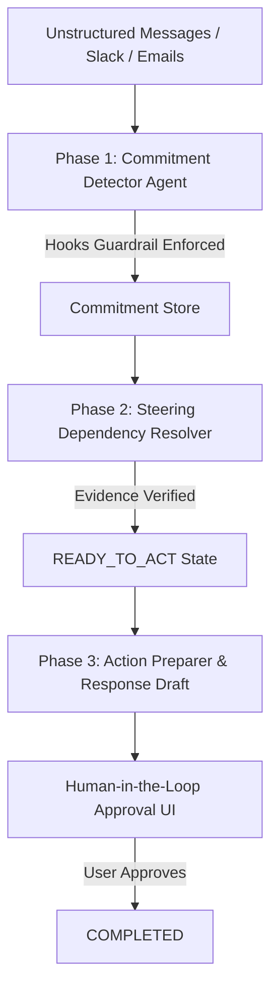

# Loose Ends 🧵
> **Deterministic Commitment Tracking & Follow-through Agent Powered by Strands Agents SDK**

[](#verification--testing)
[](#strands-agents-sdk-features)
[](#deployment--serverless-runtime)

Loose Ends transforms unfulfilled workplace promises scattered across emails, Slack messages, and meeting notes into tracked, verified, and actionable commitments. Using multi-agent steering, runtime guardrails, and evidence-grounded document search, Loose Ends ensures no workplace task falls through the cracks—without making unauthorized changes.

---

## 🏗 Architecture & Agentic Workflow

Loose Ends utilizes specialized Strands agents orchestrated across clear lifecycle phases:



---

## ⚡ Strands Agents SDK Technical Highlights

Loose Ends implements all core capabilities specified in the Strands Agents SDK roadmap:

### 1. Model Agnostic
The model factory in [`loose_ends/agent.py`](file:///c:/Users/HP/Desktop/Loose%20Ends/loose_ends/agent.py) allows seamless model swapping:
- **Google Gemini** (`gemini-2.5-flash-lite`) for rapid local execution.
- **Amazon Bedrock** (`anthropic.claude-3-haiku-20240307-v1:0`) for managed AWS runtime deployment.
- **Offline Fallback** for local test suites without API keys.

### 2. Runtime Hooks & Guardrails (`BeforeToolCallEvent`)
A deterministic runtime hook inspects tool invocations before execution:
```python
from strands.hooks import BeforeToolCallEvent

def enforce_human_approval_guardrail(event: BeforeToolCallEvent) -> None:
    tool_use = event.tool_use or {}
    tool_name = tool_use.get("name")
    tool_args = tool_use.get("input") or {}

    # Reject direct completion without explicit human review
    if tool_name == "update_commitment" and tool_args.get("status") == "COMPLETED":
        raise ValueError("Guardrail Triggered: Commitments can ONLY be completed via human approval.")
```

### 3. Steering & Dual-Agent Verification ("Buddy Agent")
- **Phase 1 Agent** detects potential commitments from conversation logs.
- **Steering Agent** inspects blocked dependencies (`WAITING_FOR_DEPENDENCY`) against message logs, transitioning status to `READY_TO_ACT` **only when explicit direct evidence exists**.

### 4. Scoped Skills & Tools
Agents are granted strictly scoped tools:
- **`commitment_tools`**: `create_commitment`, `update_commitment`, `get_open_commitments`.
- **`document_tools`**: `search_documents`, `get_document` (read-only evidence gathering).

### 5. Managed Runtime & Bedrock AgentCore Deployment
- Entry point [`lambda_function.py`](file:///c:/Users/HP/Desktop/Loose%20Ends/lambda_function.py) acts as an AWS API Gateway proxy handler.
- Infrastructure defined in [`template.yaml`](file:///c:/Users/HP/Desktop/Loose%20Ends/template.yaml) (AWS SAM / CloudFormation).

---

## 🚀 Quick Start

### 1. Prerequisites & Installation
```bash
git clone https://github.com/lina1197/Loose-Ends.git
cd Loose-Ends
python -m venv .venv
.venv\Scripts\activate
pip install -e .
```

### 2. Run Local Web Dashboard
```bash
python app.py
```
Open **`http://localhost:8000`** in your browser to view the interactive Loose Ends commitment control center.

---

## 🧪 Verification & Testing

Loose Ends maintains a 100% passing test baseline verifying determinism, store mutation isolation, and guardrail enforcement.

Run the test suite:
```bash
pytest tests/ -v
```
**Output:** `405 passed in 7.60s`

---

## 📦 Deployment to AWS Serverless / Bedrock AgentCore

Deploy Loose Ends to AWS with zero upfront cost:
```bash
sam build
sam deploy --guided
```
